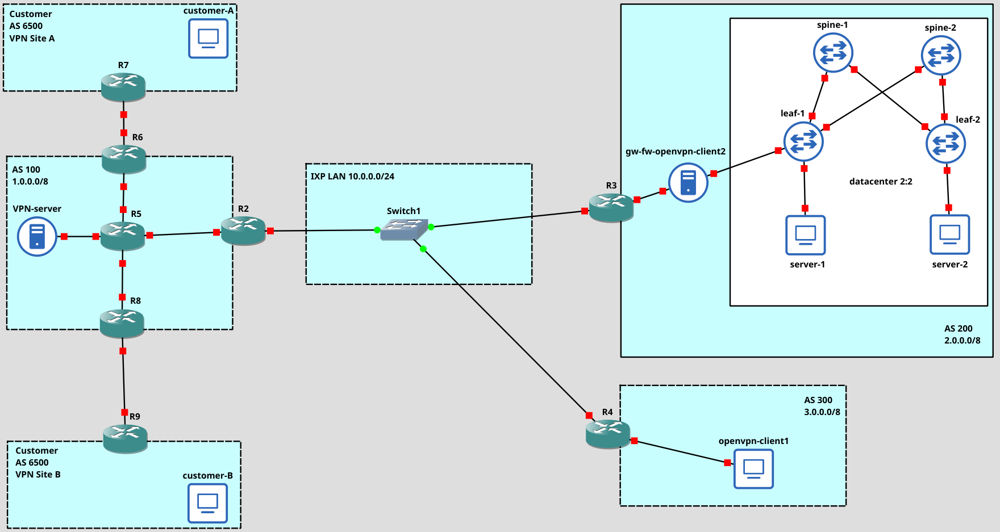

# NSD-VPNs
NSD network topology project (Prof. Bonola)

## Topology overview

For this topology, the following VM isos have been used:

| Machine name   | ISO    |
|--------------- | --------------- |
| R1-9   | Cisco router 7200   |
| opevpn-client1, server-1 and 2, customer-A and B  | lubuntu   |
| VPN-server,gw-fw-openvpn-client2  | ubuntu server   |
 

## Configuration

### AS 200
AS is composed of 

- a datacenter, in which there is a EVPN/VXLAN
- an access gateway and firewall, that allows the datacenter to be reached from WAN
- a cisco router

The configuration scripts for this piece are in `AS200` folder. 
In particular, inside `evpn\_vxlan` contains the configuration file to run EVPN/VXLAN:

- `spines` folder contains files to configure __spine-1__ and __spine-2__
- `leaves` folder contains files to configure __leaf-1__ and __leaf-2__
- `end_hosts` folder contains files to configure `server-1` and `server-2`
Finally, `gw_fw.sh` is the configuration file for the linux gateway and firewall. 
To run the scripts, just give it the proper execution permission with `chmod +x filename.sh`. 
