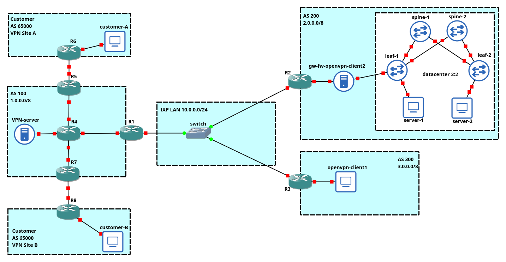

# NSD-VPNs
NSD network topology project (Prof. Bonola).

## Topology overview

For this topology, the following VM isos have been used:

| Machine name                                     | ISO               |
| :----------------------------------------------- | :---------------- |
| R1-8                                             | Cisco router 7200 |
| opevpn-client1, server 1 and 2, customer A and B | lubuntu           |
| VPN-server, gw-fw-openvpn-client2                | ubuntu server     |
 

## Configuration

### eBGP between AS100, AS200 and AS300
The comunication between the ASes is managed by eBGP protocol. Each AS has a border router linked to the IXP LAN
and comunicate the network behind him to the others routers. Only the router in AS100 applies route filtering.
The configuration of the routers is in the folder `eBGP and OSPF`

### OSPF - MPLS in AS100
Inside the AS100, the routers exchange information about the sub-networks they manage using the OSPF protocol. In addition, the packets travel in the AS through the use of labels, by means of the MPLS protocol. The configuration is in the folder `eBGP and OSPF`.

### BGP/MPLS VPN between cusomer site A and site B
The VPN permit to a packet in site A to reach the other site and vice versa. Packets travel again using MPLS protocol inside the AS100.
Only packets belonging to the VPN can travel this path, because the physical address informations are not widely propagated.
In order to establish the VPN, the previous OSPF configuration is required. The files are stored in the folder `BGP-MPLS VPN`

### AS200
AS is composed of 

- a datacenter, in which there is a EVPN/VXLAN
- an access gateway and firewall, that allows the datacenter to be reached from WAN
- a cisco router

The configuration scripts for this piece are in `AS200` folder. 
In particular, inside `evpn\_vxlan` contains the configuration file to run EVPN/VXLAN:

- `spines` folder contains files to configure __spine-1__ and __spine-2__
- `leaves` folder contains files to configure __leaf-1__ and __leaf-2__
- `end_hosts` folder contains files to configure `server-1` and `server-2`
Finally, `gw_fw.sh` is the configuration file for the linux gateway and firewall. 
To run the scripts, just give it the proper execution permission with `chmod +x filename.sh`. 

### Overlay VPN and relative topology

Directory `OverlayVPN` mantain all files for Overlay VPN configuration, it's organized in different sub-directory:

1. `Topology config`: Files for topology configuration
   1. `client1.sh`: topology file for client1, machine in AS300
   2. `client1.sh`: topology file for client2, getway in AS200
   3. `server.sh` : topology file for server , machine in AS100 
2. `Client1`: Files for client1 setup
   1. `client1.conf`: OpenVPN configuration file 
   2. `ca.crt`: public certificate of the Certification Authority
   3. `client1.crt`: public certificate of the client
   4. `client1.key`: private key of the client
3. `Client2`: Files for client2 setup
   1. `client2.conf`: OpenVPN configuration file 
   2. `ca.crt`: public certificate of the Certification Authority
   3. `client2.crt`: public certificate of the client
   4. `client2.key`: private key of the client
4. `Server`: Files for server setup
   1.  Directory `ccd`: client configuration directory, mantain client specific configuration
   2.  `server.conf`: OpenVPN configuration file
   3.  `ca.crt`: public certificate of the Certification Authority
   4.  `ca.key`: private key of the Certification Authority
   5.  `dh.pem`: Diffie-Hellman parameter
   6.  `server.crt`: public certificate of the server
   7.  `server.key`: private key of the server

#### Overlay VPN addresses:

- AS100 OpenVPN `Server` : 10.8.0.0 255.255.0.0
- AS300 Openvpn `client1`: 10.8.1.1 10.8.1.2
- AS200 Openvpn `client2`: 10.8.2.1 10.8.2.2

